# Auto-generated Dashboard Manual

Generated by C2M DocGen. Each section below corresponds to one screenshot, shown inline below its explanation.

---

## https://staging-internal.codewetrust-api.com/

**URL:** `https://staging-internal.codewetrust-api.com/`

**What you can do here**

- **Other actions:** Quality Benchmark, Reports, Restore Deleted, Blind Audit, Add Product

---
## https://staging-internal.codewetrust-api.com/add-product

**URL:** `https://staging-internal.codewetrust-api.com/add-product`

**What you can do here**

- **Other actions:** Start scanning, Configure

---
## https://staging-internal.codewetrust-api.com/products

**URL:** `https://staging-internal.codewetrust-api.com/products`

**What you can do here**

- **Other actions:** Quality Benchmark, Reports, Restore Deleted, Blind Audit, Add Product

---
## https://staging-internal.codewetrust-api.com/settings

**URL:** `https://staging-internal.codewetrust-api.com/settings`

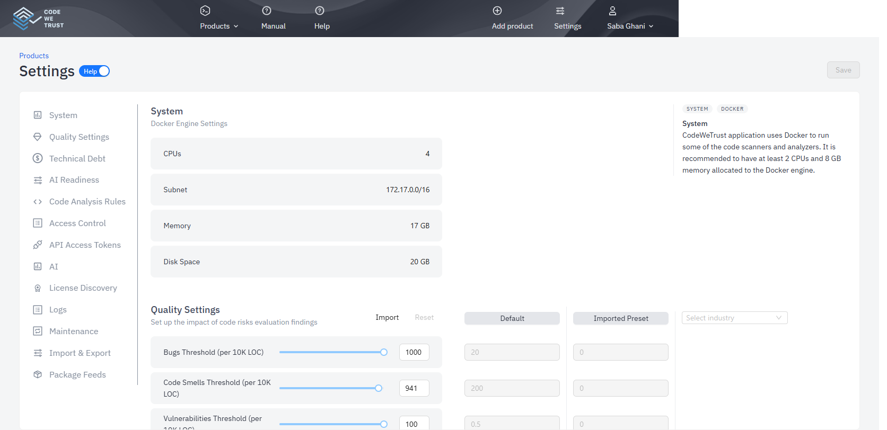

**What you're looking at**

- A table with columns: Enabled, ID, Name, Type, Severity, Language, Description, Internal Key

**What you can do here**

- **Export/save:** Save or Download Log File or Export Code Analysis Settings or Download DB
- **Other actions:** Help
Help, Import, Reset, Default, Imported Preset, Show/hide columns, Add Access Control Entry, Generate token, Add AI Provider Key, Database Cleanup, Import Code Analysis Settings, Add Package Feed
- **Dropdown filters:** Select industry, Critical, Blocker, Blocker, Blocker, Critical, Select industry, Select industry, 25 / page, an unlabeled dropdown
- **Column filters:** 6 column(s) can be filtered/searched
- **Pagination:** 855 pages, 25 / page

---
## https://staging-internal.codewetrust-api.com/profile

**URL:** `https://staging-internal.codewetrust-api.com/profile`

**What you can do here**

- **Other actions:** Log out

---
## https://staging-internal.codewetrust-api.com/analyzed-repository/000c0000-6e13-0646-2d75-08de184b64cd

**URL:** `https://staging-internal.codewetrust-api.com/analyzed-repository/000c0000-6e13-0646-2d75-08de184b64cd`

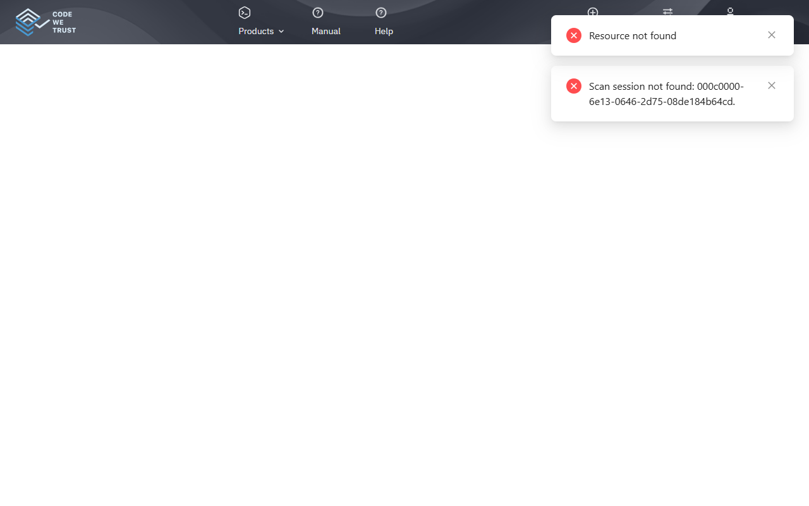

_No interactive controls or data visualizations detected._

---
## https://staging-internal.codewetrust-api.com/product/000c0000-6e13-0646-2d75-08de184b64cd

**URL:** `https://staging-internal.codewetrust-api.com/`

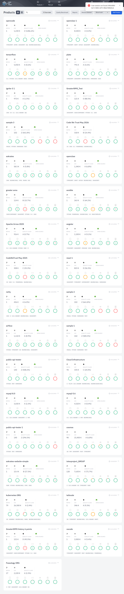

**What you can do here**

- **Other actions:** Quality Benchmark, Reports, Restore Deleted, Blind Audit, Add Product

---
## Tech Stack > Charts

**URL:** `https://staging-internal.codewetrust-api.com/analyzed-repository/000c0000-6e13-0646-fa5d-08de6976a3af`

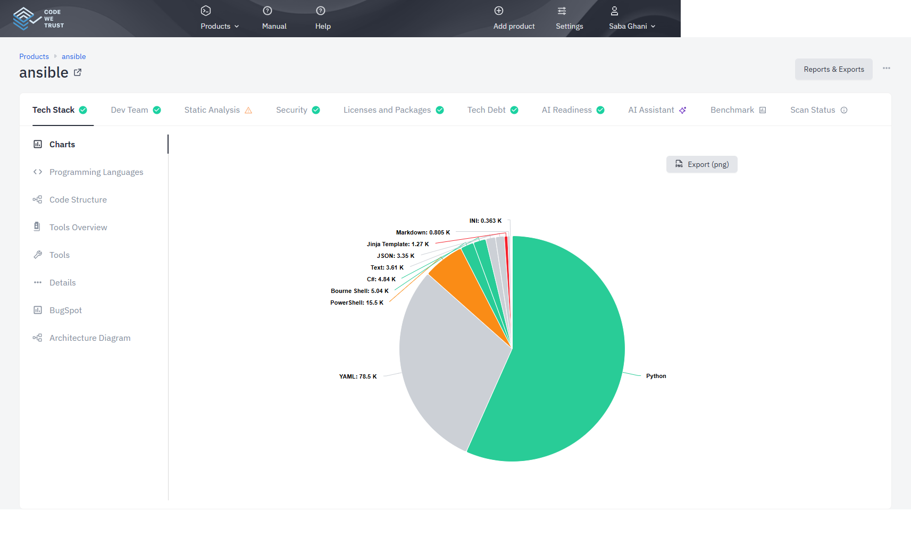

**What you're looking at**

- A pie chart titled "Tech Stack Pie Chart"

**What you can do here**

- **Export/save:** png

---
## Tech Stack > Programming Languages

**URL:** `https://staging-internal.codewetrust-api.com/analyzed-repository/000c0000-6e13-0646-fa5d-08de6976a3af`

**What you're looking at**

- A table with columns: Language, Files, % Comment LOC, Code Lines, % Code Lines VS repository, Type, Rank

**What you can do here**

- **Export/save:** csv
- **Other actions:** Show/hide columns
- **Column filters:** 2 column(s) can be filtered/searched

---
## Tech Stack > Code Structure

**URL:** `https://staging-internal.codewetrust-api.com/analyzed-repository/000c0000-6e13-0646-fa5d-08de6976a3af`

**What you can do here**

- **Export/save:** csv
- **Other actions:** Show/hide columns

---
## Tech Stack > Tools Overview

**URL:** `https://staging-internal.codewetrust-api.com/analyzed-repository/000c0000-6e13-0646-fa5d-08de6976a3af`

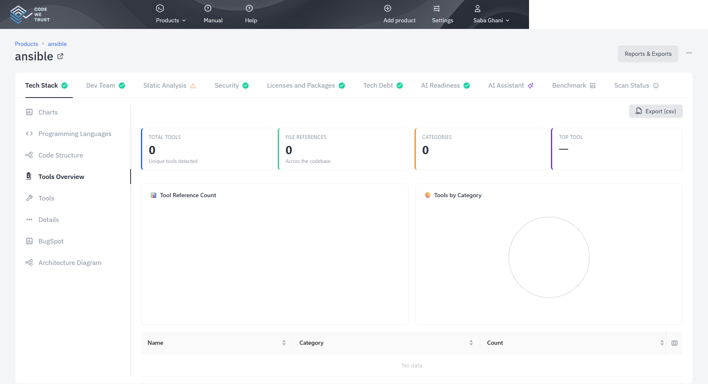

**What you're looking at**

- A pie chart titled "Tools Details"
- A table with columns: Name, Category, Count

**What you can do here**

- **Export/save:** csv
- **Other actions:** Show/hide columns

---
## Tech Stack > Tools

**URL:** `https://staging-internal.codewetrust-api.com/analyzed-repository/000c0000-6e13-0646-fa5d-08de6976a3af`

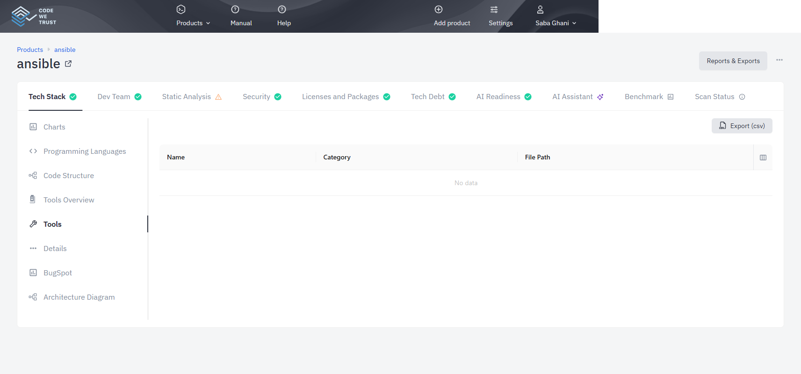

**What you can do here**

- **Export/save:** csv
- **Other actions:** Show/hide columns

---
## Tech Stack > Details

**URL:** `https://staging-internal.codewetrust-api.com/analyzed-repository/000c0000-6e13-0646-fa5d-08de6976a3af`

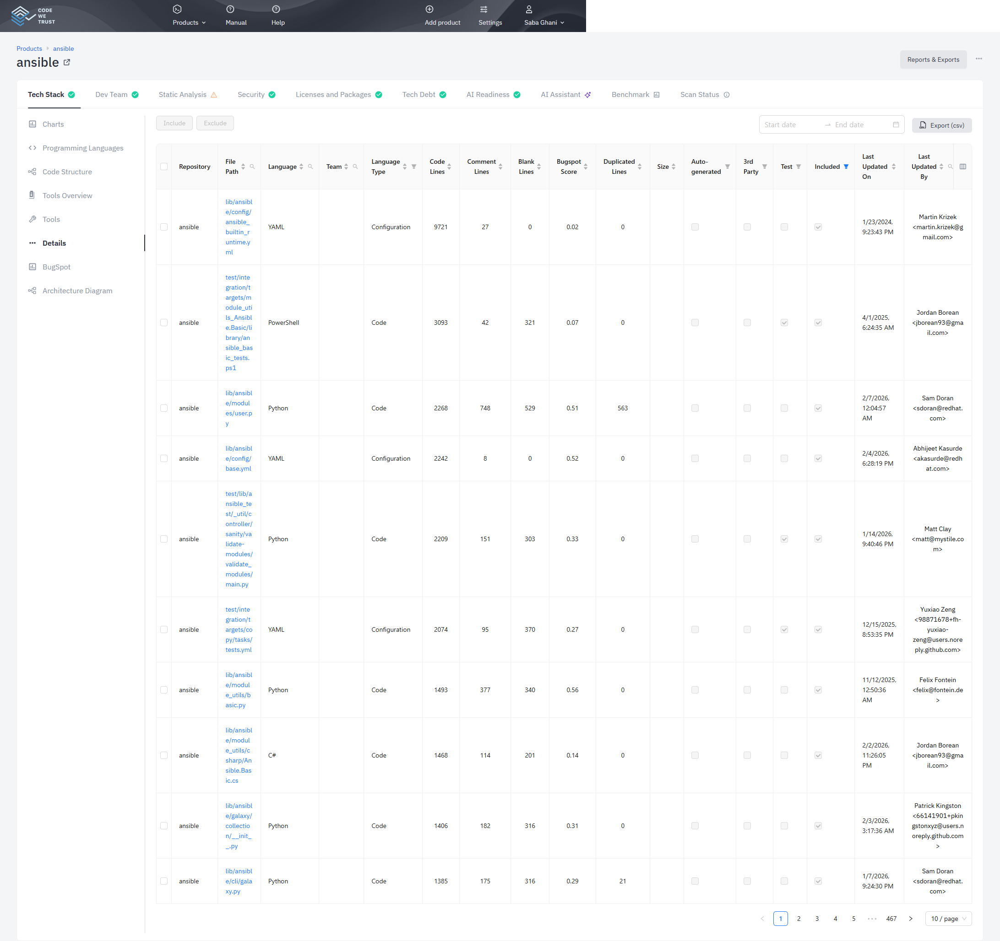

**What you're looking at**

- A table with columns: File Path, Language, Team, Language Type, Code Lines, Comment Lines, Blank Lines, Bugspot Score, Duplicated Lines, Size, Auto-generated, 3rd Party, Test, Included, Last Updated On, Last Updated By

**What you can do here**

- **Export/save:** csv
- **Other actions:** Include, Exclude, Show/hide columns
- **Date filter:** filter this view by a date range (1 control(s))
- **Dropdown filters:** 10 / page
- **Column filters:** 9 column(s) can be filtered/searched
- **Pagination:** 467 pages, 10 / page

---
## Tech Stack > BugSpot

**URL:** `https://staging-internal.codewetrust-api.com/analyzed-repository/000c0000-6e13-0646-fa5d-08de6976a3af`

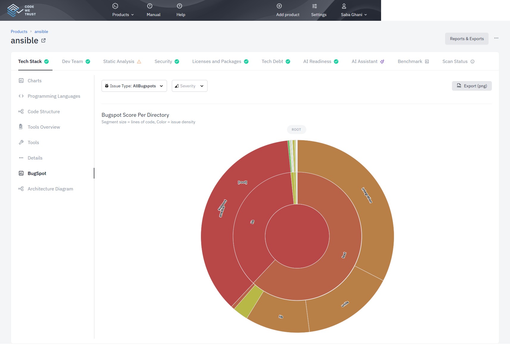

**What you're looking at**

- A chart titled "BugSpot Sunburst Chart"

**What you can do here**

- **Export/save:** png

---
## Tech Stack > Architecture Diagram

**URL:** `https://staging-internal.codewetrust-api.com/analyzed-repository/000c0000-6e13-0646-fa5d-08de6976a3af`

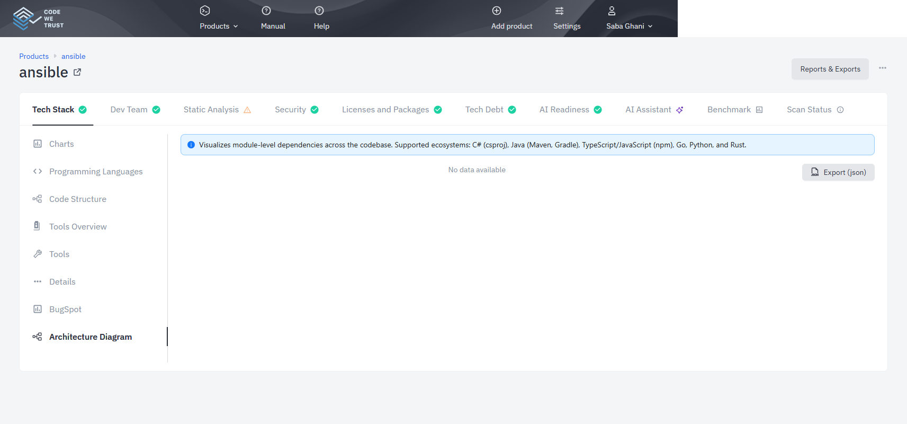

**What you can do here**

- **Export/save:** json

---
## Dev Team > Charts

**URL:** `https://staging-internal.codewetrust-api.com/analyzed-repository/000c0000-6e13-0646-fa5d-08de6976a3af`

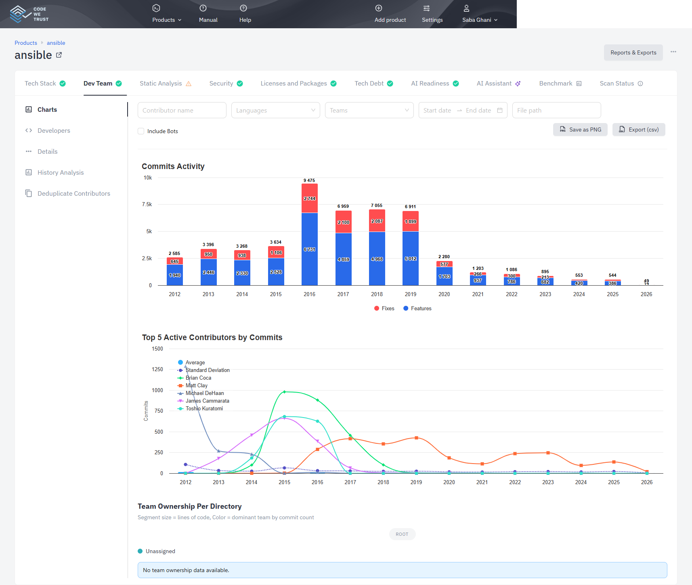

**What you're looking at**

- A bar chart titled "DEV_TEAM_CHARTS"

**What you can do here**

- **Export/save:** Save as PNG or csv
- **Date filter:** filter this view by a date range (1 control(s))
- **Dropdown filters:** Languages, Teams

---
## Dev Team > Developers

**URL:** `https://staging-internal.codewetrust-api.com/analyzed-repository/000c0000-6e13-0646-fa5d-08de6976a3af`

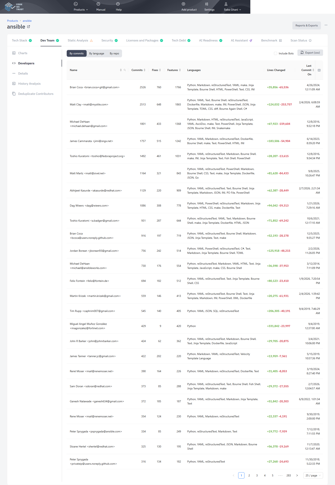

**What you're looking at**

- A table with columns: Name, Commits, Fixes, Features, Last Commit On

**What you can do here**

- **Export/save:** csv
- **Other actions:** Show/hide columns
- **Dropdown filters:** 25 / page
- **Column filters:** 1 column(s) can be filtered/searched
- **Pagination:** 283 pages, 25 / page

---
## Dev Team > Details

**URL:** `https://staging-internal.codewetrust-api.com/analyzed-repository/000c0000-6e13-0646-fa5d-08de6976a3af`

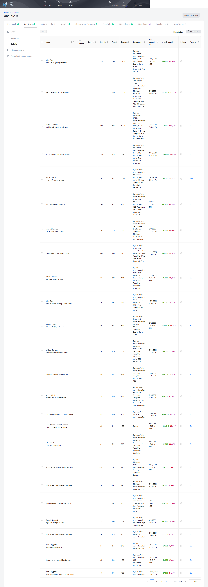

**What you're looking at**

- A table with columns: Name, Team, Commits, Fixes, Features, Languages, Last Commit On

**What you can do here**

- **Export/save:** csv
- **Other actions:** Edit, Show/hide columns
- **Dropdown filters:** 25 / page
- **Column filters:** 2 column(s) can be filtered/searched
- **Pagination:** 283 pages, 25 / page

---
## Dev Team > History Analysis

**URL:** `https://staging-internal.codewetrust-api.com/analyzed-repository/000c0000-6e13-0646-fa5d-08de6976a3af`

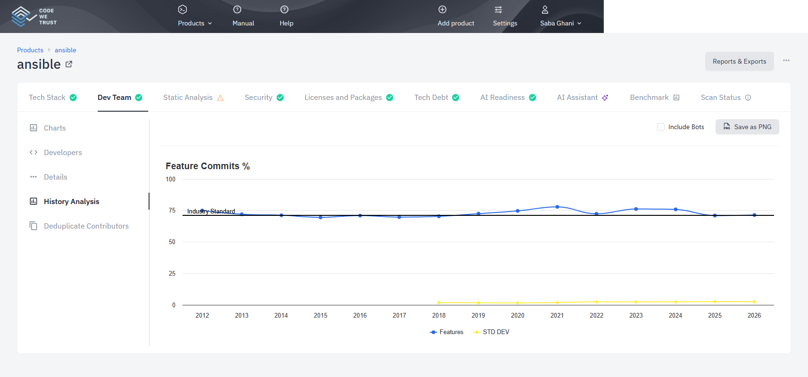

**What you're looking at**

- A chart titled "DEV_TEAM_HISTORY_ANALYSIS"

**What you can do here**

- **Export/save:** Save as PNG

---
## Dev Team > Deduplicate Contributors

**URL:** `https://staging-internal.codewetrust-api.com/analyzed-repository/000c0000-6e13-0646-fa5d-08de6976a3af`

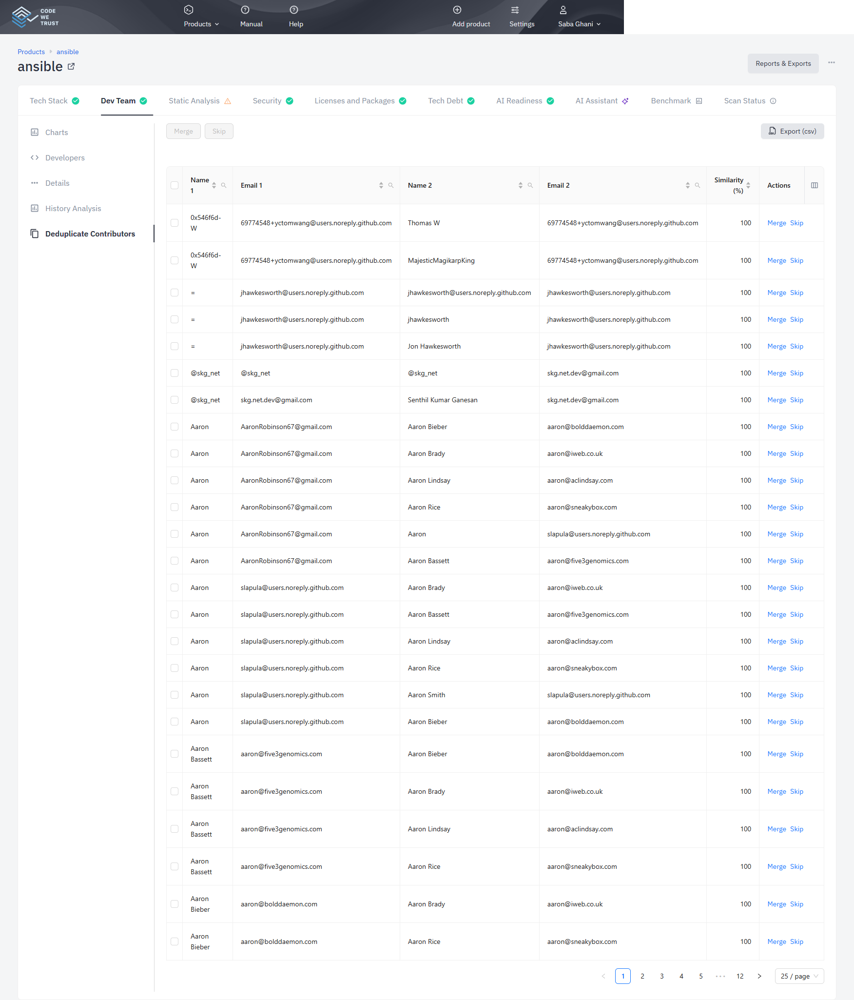

**What you're looking at**

- A table with columns: Name 1, Email 1, Name 2, Email 2, Similarity (%)

**What you can do here**

- **Export/save:** csv
- **Other actions:** Merge, Skip, Show/hide columns
- **Dropdown filters:** 25 / page
- **Column filters:** 4 column(s) can be filtered/searched
- **Pagination:** 12 pages, 25 / page

---
## Static Analysis > Charts

**URL:** `https://staging-internal.codewetrust-api.com/analyzed-repository/000c0000-6e13-0646-fa5d-08de6976a3af`

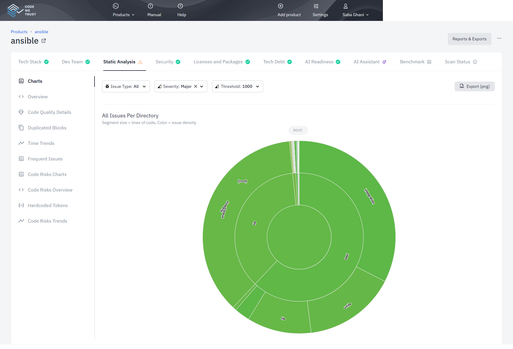

**What you're looking at**

- A chart titled "Static Code Analysis Sunburst Chart"

**What you can do here**

- **Export/save:** png

---
## Static Analysis > Overview

**URL:** `https://staging-internal.codewetrust-api.com/analyzed-repository/000c0000-6e13-0646-fa5d-08de6976a3af`

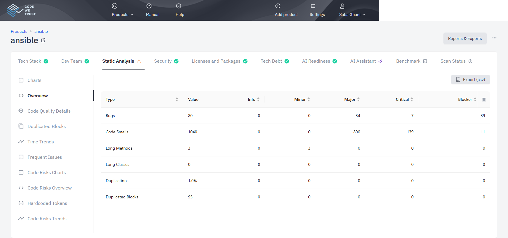

**What you're looking at**

- A table with columns: Type, Info, Minor, Major, Critical, Blocker

**What you can do here**

- **Export/save:** csv
- **Other actions:** Show/hide columns

---
## Static Analysis > Code Quality Details

**URL:** `https://staging-internal.codewetrust-api.com/analyzed-repository/000c0000-6e13-0646-fa5d-08de6976a3af`

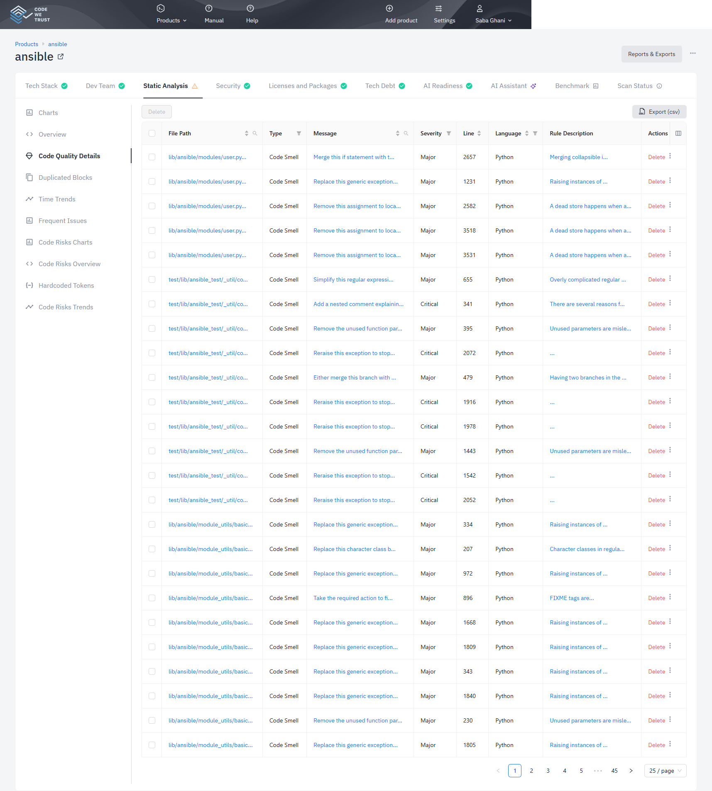

**What you're looking at**

- A table with columns: File Path, Type, Message, Severity, Line, Language

**What you can do here**

- **Export/save:** csv
- **Other actions:** Delete, Show/hide columns
- **Dropdown filters:** 25 / page
- **Column filters:** 5 column(s) can be filtered/searched
- **Pagination:** 45 pages, 25 / page

---
## Static Analysis > Duplicated Blocks

**URL:** `https://staging-internal.codewetrust-api.com/analyzed-repository/000c0000-6e13-0646-fa5d-08de6976a3af`

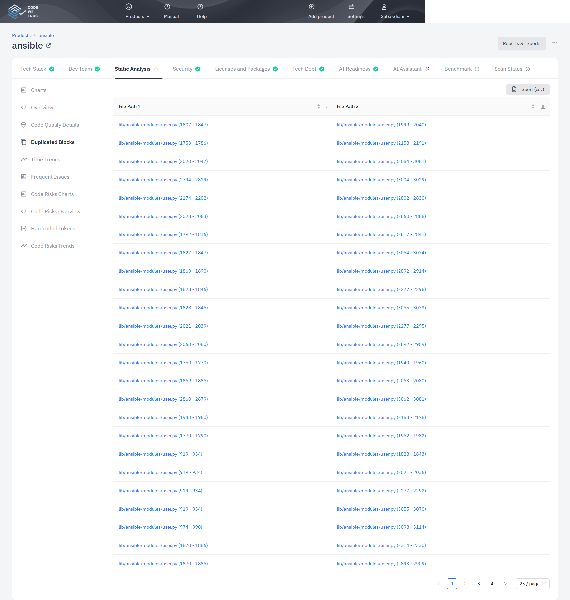

**What you're looking at**

- A table with columns: File Path 1, File Path 2

**What you can do here**

- **Export/save:** csv
- **Other actions:** Show/hide columns
- **Dropdown filters:** 25 / page
- **Column filters:** 1 column(s) can be filtered/searched
- **Pagination:** 4 pages, 25 / page

---
## Static Analysis > Time Trends

**URL:** `https://staging-internal.codewetrust-api.com/analyzed-repository/000c0000-6e13-0646-fa5d-08de6976a3af`

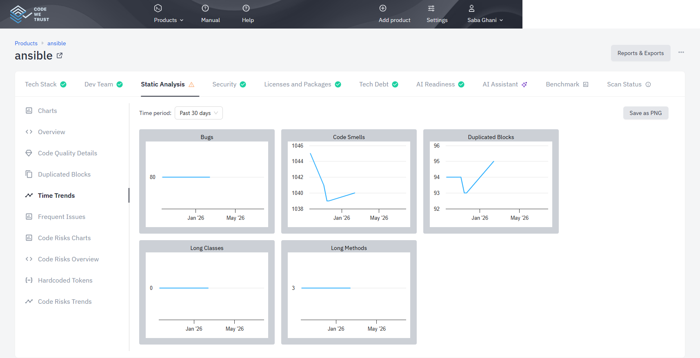

**What you're looking at**

- A line chart titled "Static Code Analysis Time Trends"

**What you can do here**

- **Export/save:** Save as PNG
- **Dropdown filters:** Past 30 days

---
## Static Analysis > Frequent Issues

**URL:** `https://staging-internal.codewetrust-api.com/analyzed-repository/000c0000-6e13-0646-fa5d-08de6976a3af`

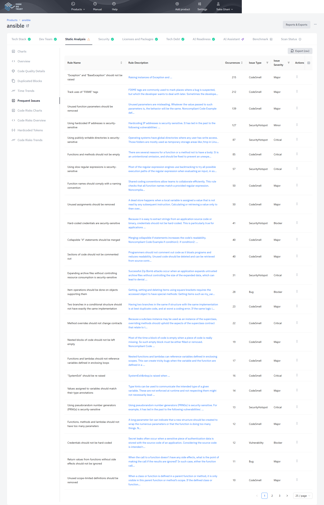

**What you're looking at**

- A table with columns: Rule Name, Occurrences, Issue Type, Issue Severity

**What you can do here**

- **Export/save:** csv
- **Other actions:** Show/hide columns
- **Dropdown filters:** 25 / page
- **Column filters:** 2 column(s) can be filtered/searched
- **Pagination:** 3 pages, 25 / page

---
## Static Analysis > Code Risks Charts

**URL:** `https://staging-internal.codewetrust-api.com/analyzed-repository/000c0000-6e13-0646-fa5d-08de6976a3af`

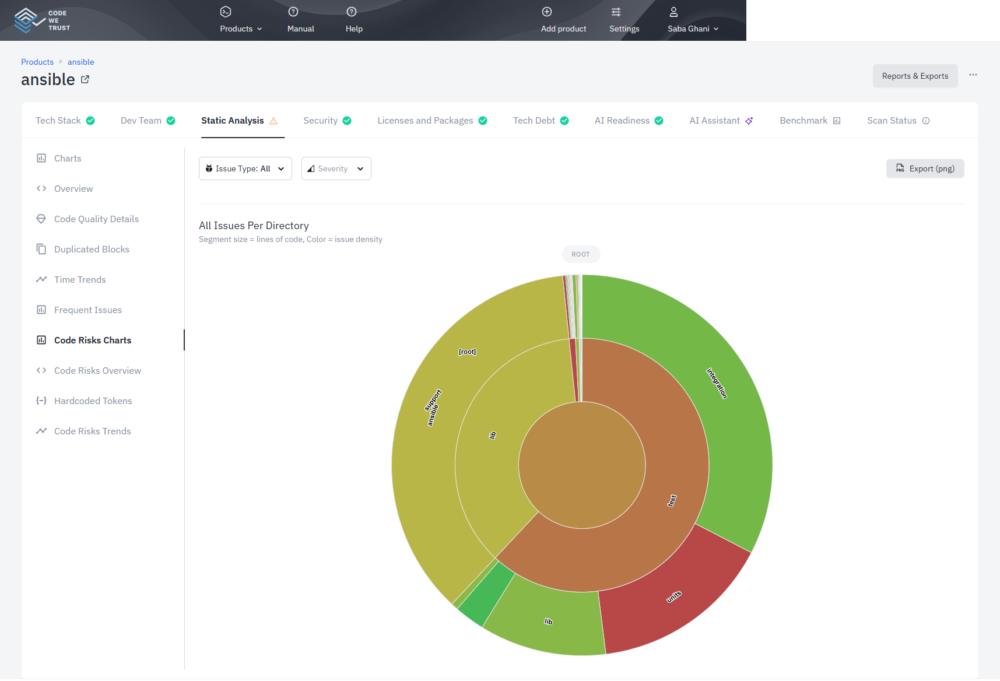

**What you're looking at**

- A chart titled "Code Risks Sunburst Chart"

**What you can do here**

- **Export/save:** png

---
## Static Analysis > Code Risks Overview

**URL:** `https://staging-internal.codewetrust-api.com/analyzed-repository/000c0000-6e13-0646-fa5d-08de6976a3af`

**What you're looking at**

- A table with columns: apiKeys, Domains, Files, IPs, Passwords, Private Keys, User IDs

**What you can do here**

- **Export/save:** csv
- **Other actions:** Show/hide columns

---
## Static Analysis > Hardcoded Tokens

**URL:** `https://staging-internal.codewetrust-api.com/analyzed-repository/000c0000-6e13-0646-fa5d-08de6976a3af`

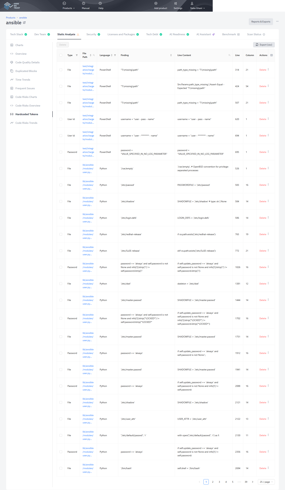

**What you're looking at**

- A table with columns: Type, File Path, Language, Finding, Line Content

**What you can do here**

- **Export/save:** csv
- **Other actions:** Delete, Show/hide columns
- **Dropdown filters:** 25 / page
- **Column filters:** 4 column(s) can be filtered/searched
- **Pagination:** 39 pages, 25 / page

---
## Static Analysis > Code Risks Trends

**URL:** `https://staging-internal.codewetrust-api.com/analyzed-repository/000c0000-6e13-0646-fa5d-08de6976a3af`

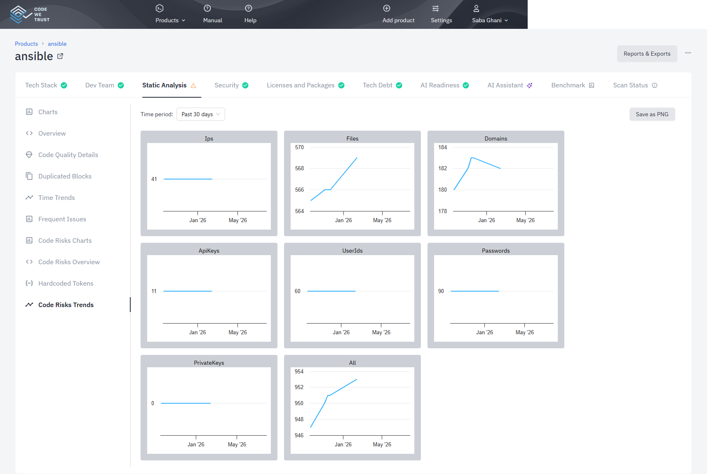

**What you're looking at**

- A line chart titled "Code Risks Time Trends"

**What you can do here**

- **Export/save:** Save as PNG
- **Dropdown filters:** Past 30 days

---
## Security > Charts

**URL:** `https://staging-internal.codewetrust-api.com/analyzed-repository/000c0000-6e13-0646-fa5d-08de6976a3af`

**What you're looking at**

- A chart titled "Security Analysis Sunburst Chart"

**What you can do here**

- **Export/save:** png

---
## Security > Overview

**URL:** `https://staging-internal.codewetrust-api.com/analyzed-repository/000c0000-6e13-0646-fa5d-08de6976a3af`

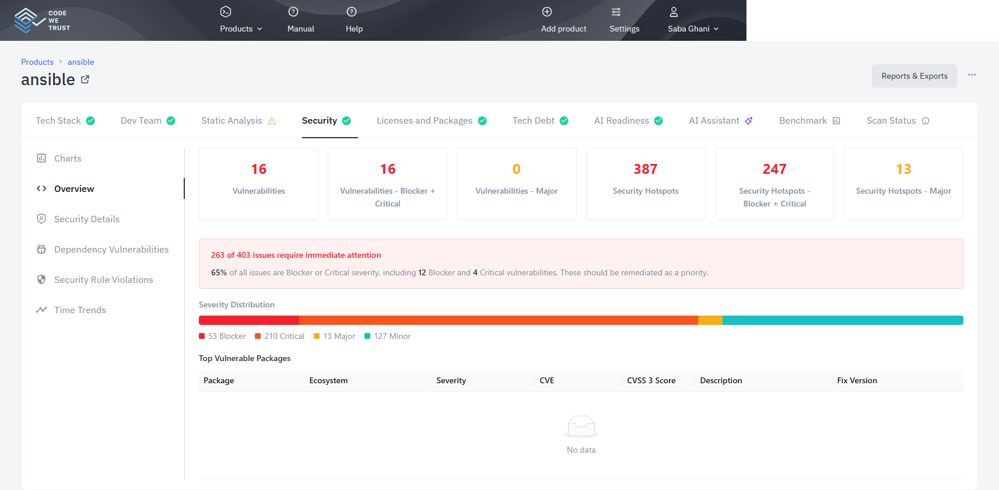

_No interactive controls or data visualizations detected._

---
## Security > Security Details

**URL:** `https://staging-internal.codewetrust-api.com/analyzed-repository/000c0000-6e13-0646-fa5d-08de6976a3af`

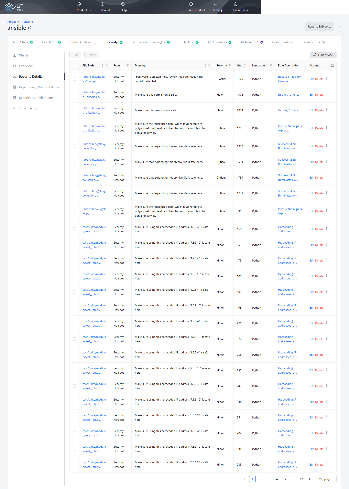

**What you're looking at**

- A table with columns: File Path, Type, Message, Severity, Line, Language

**What you can do here**

- **Export/save:** csv
- **Other actions:** Edit, Delete, Show/hide columns
- **Dropdown filters:** 25 / page
- **Column filters:** 5 column(s) can be filtered/searched
- **Pagination:** 17 pages, 25 / page

---
## Security > Dependency Vulnerabilities

**URL:** `https://staging-internal.codewetrust-api.com/analyzed-repository/000c0000-6e13-0646-fa5d-08de6976a3af`

**What you're looking at**

- A table with columns: Severity, Name, Occurrences, Vulnerability Id, CVSS 3 Score, CVSS 2 Score, Exploitability Score, Type

**What you can do here**

- **Export/save:** csv
- **Other actions:** Show/hide columns
- **Column filters:** 3 column(s) can be filtered/searched

---
## Security > Security Rule Violations

**URL:** `https://staging-internal.codewetrust-api.com/analyzed-repository/000c0000-6e13-0646-fa5d-08de6976a3af`

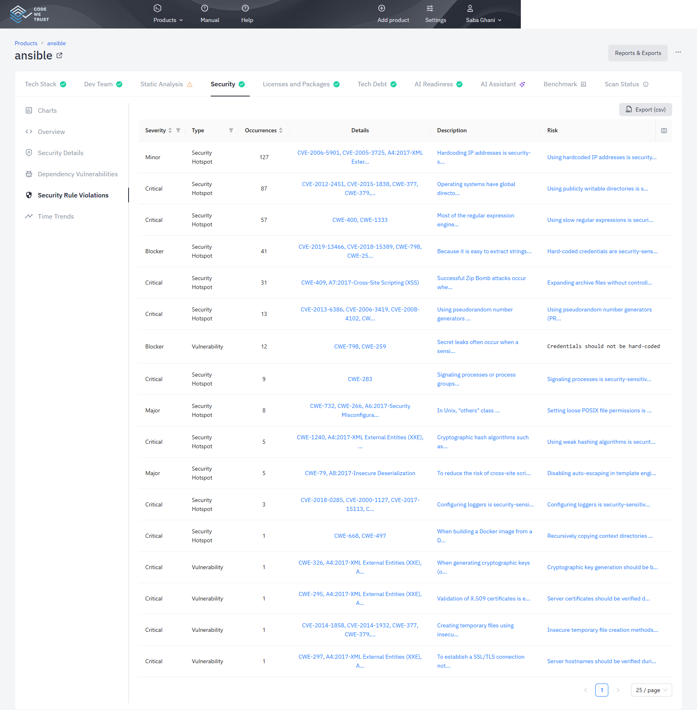

**What you're looking at**

- A table with columns: Severity, Type, Occurrences

**What you can do here**

- **Export/save:** csv
- **Other actions:** Show/hide columns
- **Dropdown filters:** 25 / page
- **Column filters:** 2 column(s) can be filtered/searched
- **Pagination:** 1 pages, 25 / page

---
## Security > Time Trends

**URL:** `https://staging-internal.codewetrust-api.com/analyzed-repository/000c0000-6e13-0646-fa5d-08de6976a3af`

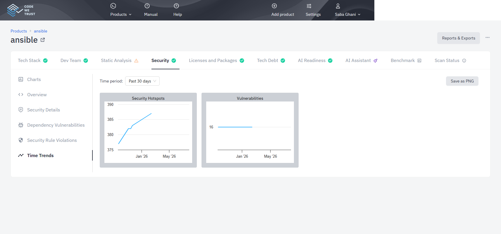

**What you're looking at**

- A line chart titled "Security Analysis Time Trends"

**What you can do here**

- **Export/save:** Save as PNG
- **Dropdown filters:** Past 30 days

---
## Licenses and Packages > Charts

**URL:** `https://staging-internal.codewetrust-api.com/analyzed-repository/000c0000-6e13-0646-fa5d-08de6976a3af`

**What you're looking at**

- A chart titled "License Compliance Sunburts Chart"

**What you can do here**

- **Export/save:** png

---
## Licenses and Packages > Licenses Overview

**URL:** `https://staging-internal.codewetrust-api.com/analyzed-repository/000c0000-6e13-0646-fa5d-08de6976a3af`

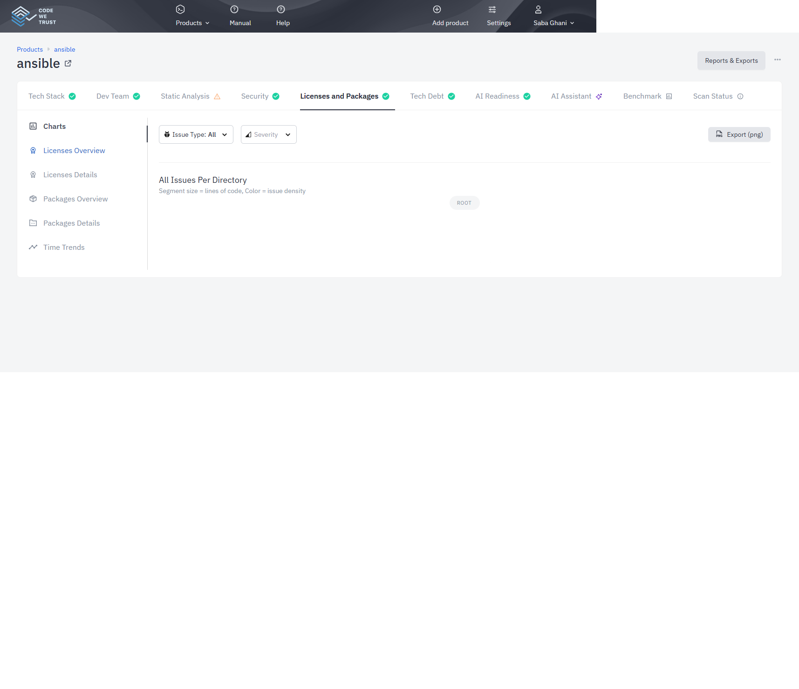

**What you're looking at**

- A chart titled "License Compliance Sunburts Chart"

**What you can do here**

- **Export/save:** png

---
## Licenses and Packages > Licenses Details

**URL:** `https://staging-internal.codewetrust-api.com/analyzed-repository/000c0000-6e13-0646-fa5d-08de6976a3af`

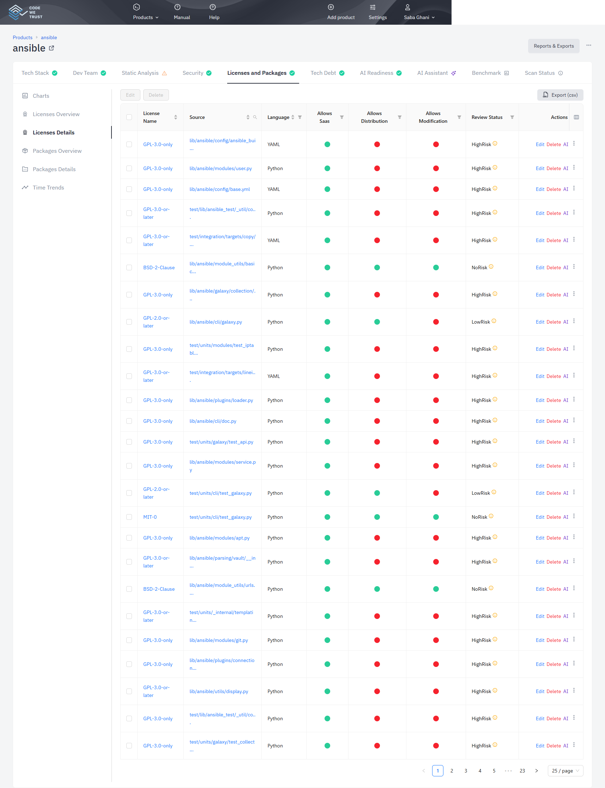

**What you're looking at**

- A table with columns: License Name, Source, Language, Allows Saas, Allows Distribution, Allows Modification, Review Status

**What you can do here**

- **Export/save:** csv
- **Other actions:** Edit, Delete, Show/hide columns
- **Dropdown filters:** 25 / page
- **Column filters:** 6 column(s) can be filtered/searched
- **Pagination:** 23 pages, 25 / page

---
## Licenses and Packages > Packages Overview

**URL:** `https://staging-internal.codewetrust-api.com/analyzed-repository/000c0000-6e13-0646-fa5d-08de6976a3af`

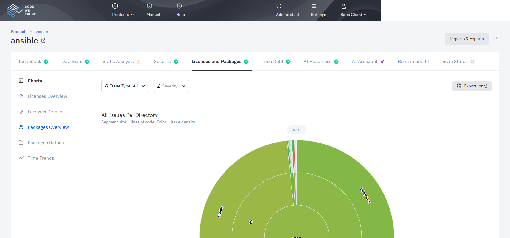

**What you're looking at**

- A chart titled "License Compliance Sunburts Chart"

**What you can do here**

- **Export/save:** png

---
## Licenses and Packages > Packages Details

**URL:** `https://staging-internal.codewetrust-api.com/analyzed-repository/000c0000-6e13-0646-fa5d-08de6976a3af`

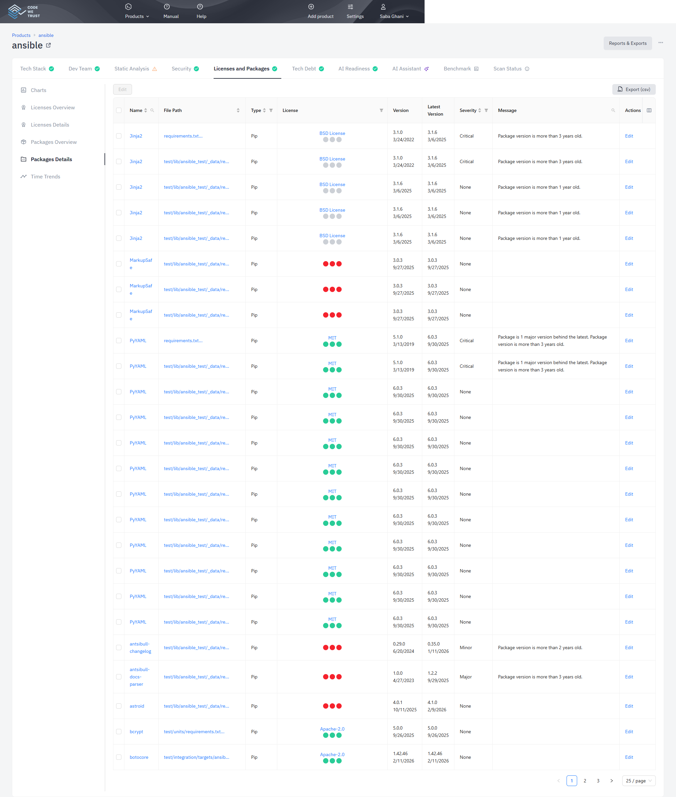

**What you're looking at**

- A table with columns: Name, File Path, Type, License, Severity, Message

**What you can do here**

- **Export/save:** csv
- **Other actions:** Edit, Show/hide columns
- **Dropdown filters:** 25 / page
- **Column filters:** 5 column(s) can be filtered/searched
- **Pagination:** 3 pages, 25 / page

---
## Licenses and Packages > Time Trends

**URL:** `https://staging-internal.codewetrust-api.com/analyzed-repository/000c0000-6e13-0646-fa5d-08de6976a3af`

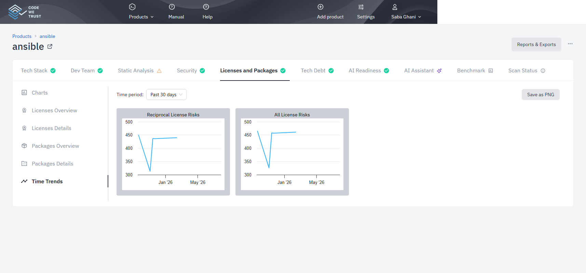

**What you're looking at**

- A line chart titled "License Compliance Time Trends"

**What you can do here**

- **Export/save:** Save as PNG
- **Dropdown filters:** Past 30 days

---
## Tech Debt

**URL:** `https://staging-internal.codewetrust-api.com/analyzed-repository/000c0000-6e13-0646-fa5d-08de6976a3af`

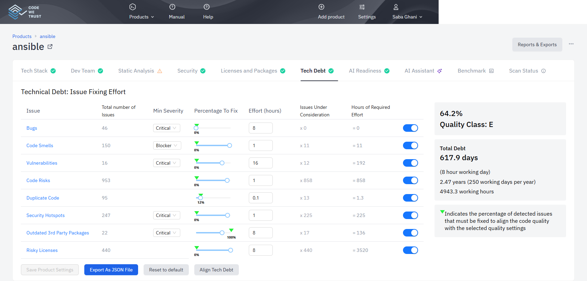

**What you can do here**

- **Export/save:** Save Product Settings or Export As JSON File
- **Other actions:** Reset to default, Align Tech Debt
- **Dropdown filters:** Critical, Blocker, Critical, Critical, Critical

---
## AI Readiness

**URL:** `https://staging-internal.codewetrust-api.com/analyzed-repository/000c0000-6e13-0646-fa5d-08de6976a3af`

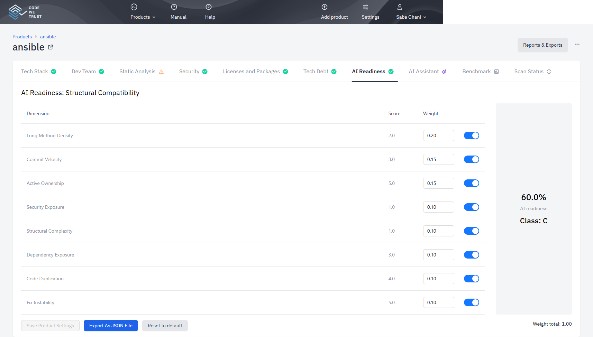

**What you can do here**

- **Export/save:** Save Product Settings or Export As JSON File
- **Other actions:** Reset to default

---
## AI Assistant

**URL:** `https://staging-internal.codewetrust-api.com/analyzed-repository/000c0000-6e13-0646-fa5d-08de6976a3af`

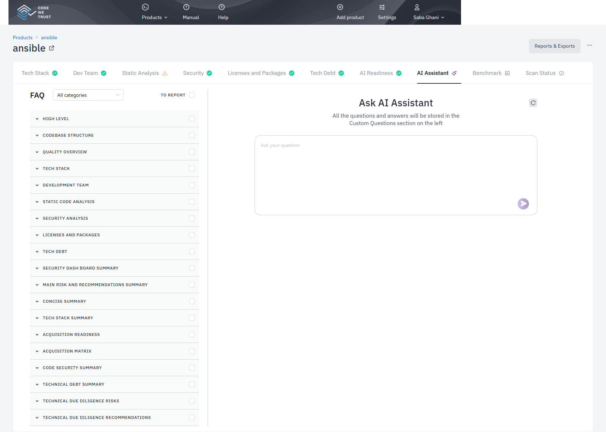

**What you can do here**

- **Dropdown filters:** All categories

---
## Benchmark

**URL:** `https://staging-internal.codewetrust-api.com/analyzed-repository/000c0000-6e13-0646-fa5d-08de6976a3af`

**What you can do here**

- **Export/save:** PDF
- **Dropdown filters:** AI Integration

---
## Scan Status > Job Details

**URL:** `https://staging-internal.codewetrust-api.com/analyzed-repository/000c0000-6e13-0646-fa5d-08de6976a3af`

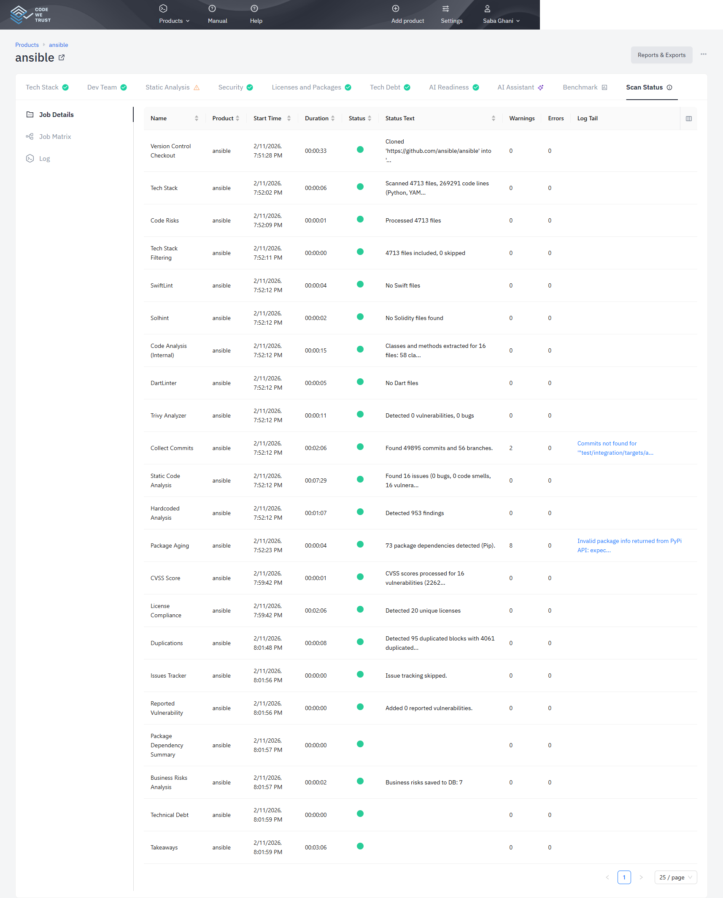

**What you're looking at**

- A table with columns: Name, Product, Start Time, Duration, Status, Status Text

**What you can do here**

- **Other actions:** Show/hide columns
- **Dropdown filters:** 25 / page
- **Pagination:** 1 pages, 25 / page

---
## Scan Status > Job Matrix

**URL:** `https://staging-internal.codewetrust-api.com/analyzed-repository/000c0000-6e13-0646-fa5d-08de6976a3af`

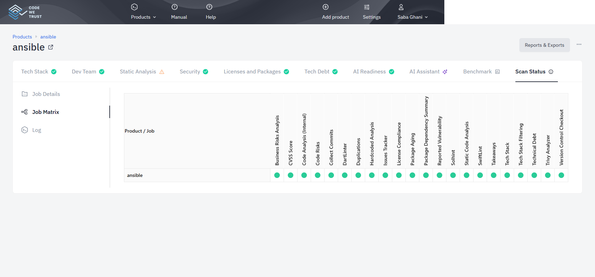

_No interactive controls or data visualizations detected._

---
## Scan Status > Log

**URL:** `https://staging-internal.codewetrust-api.com/analyzed-repository/000c0000-6e13-0646-fa5d-08de6976a3af`

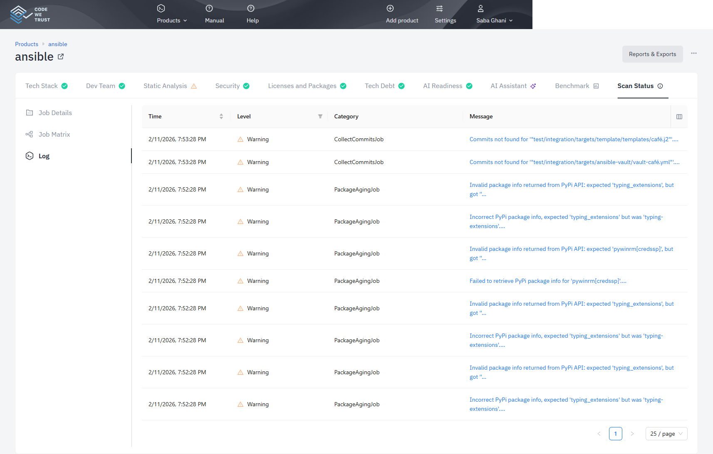

**What you're looking at**

- A table with columns: Time, Level

**What you can do here**

- **Other actions:** Show/hide columns
- **Dropdown filters:** 25 / page
- **Column filters:** 1 column(s) can be filtered/searched
- **Pagination:** 1 pages, 25 / page

---
## https://staging-internal.codewetrust-api.com/product/000c0000-6e13-0646-fa5d-08de6976a3af

**URL:** `https://staging-internal.codewetrust-api.com/product/000c0000-6e13-0646-fa5d-08de6976a3af`

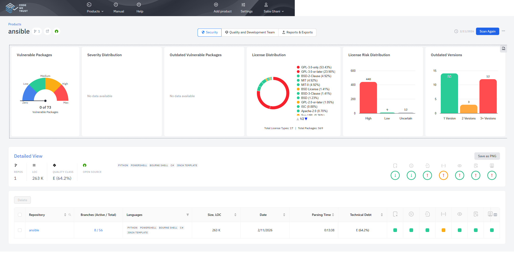

**What you're looking at**

- A chart titled "root"
- A pie chart titled "Security License Distribution"
- A bar chart titled "Security License Risk Distribution"
- A bar chart titled "Security Outdated Versions"
- A bar chart titled "Quality and Development Team Defects"
- A pie chart titled "Quality and Development Team Tech Stack"
- A bar chart titled "Quality and Development Team Commit Activity"
- A table with columns: Repository, Languages, Size, LOC, Date, Parsing Time, Technical Debt

**What you can do here**

- **Export/save:** Save as PNG
- **Other actions:** Scan Again, PPTX, PDF, CSV, Delete, Rescan, Show/hide columns
- **Column filters:** 2 column(s) can be filtered/searched

---
## https://staging-internal.codewetrust-api.com/product/P-000c0000-6e13-0646-1473-08dd1068aa47

**URL:** `https://staging-internal.codewetrust-api.com/product/P-000c0000-6e13-0646-1473-08dd1068aa47`

**What you're looking at**

- A chart titled "root"
- A pie chart titled "Security License Distribution"
- A bar chart titled "Security License Risk Distribution"
- A bar chart titled "Security Outdated Versions"
- A bar chart titled "Quality and Development Team Defects"
- A pie chart titled "Quality and Development Team Tech Stack"
- A bar chart titled "Quality and Development Team Commit Activity"
- A table with columns: Repository, Languages, Size, LOC, Date, Parsing Time, Technical Debt

**What you can do here**

- **Export/save:** Save as PNG
- **Other actions:** Scan Again, PPTX, PDF, CSV, Delete, Rescan, Show/hide columns
- **Column filters:** 2 column(s) can be filtered/searched

---
